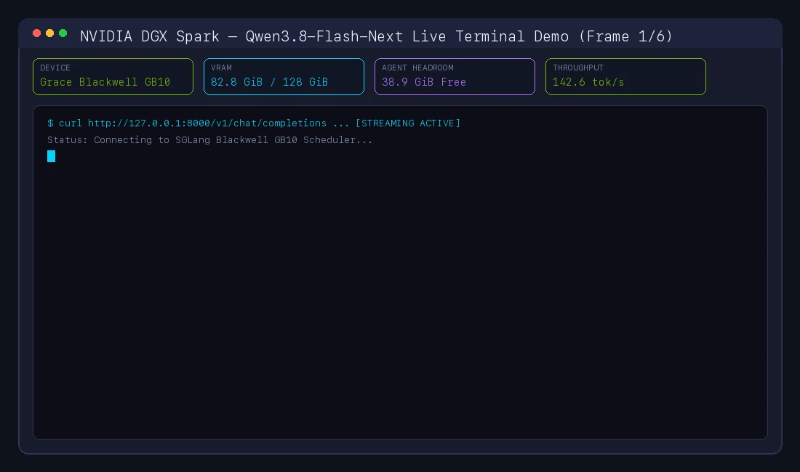
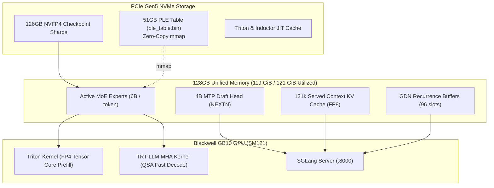

# Qwen3.8-Flash-Next on 1x NVIDIA DGX Spark (128GB) with SGLang & NVMe PLE Offloading

[-76B900?logo=nvidia)](https://www.nvidia.com)
[-blue)](https://huggingface.co/RadixArk/Qwen3.8-Flash-Next-NVFP4)
[-brightgreen)](https://github.com/sgl-project/sglang)
[-orange)](https://github.com/sgl-project/sglang)
[](LICENSE)

A production-grade, battle-tested recipe for serving **Qwen3.8-Flash-Next (180B Hybrid MoE / Qwen4 Preview)** on a single **128GB NVIDIA DGX Spark (Grace Blackwell GB10, SM121)** using NVFP4 quantization, zero-copy NVMe memory-mapped PLE offloading, and NEXTN Multi-Token Prediction (MTP).

---

## 📺 Live Telemetry Demo (Animated Stream)



---

## 🎯 Architecture Overview



### Key Technical Pillars

1. **Hybrid Architecture (GDN + QSA):** Combines Gated DeltaNet linear recurrence with Qwen Sparse Attention, serving **131,072 tokens (131k)** in production (architecturally capable of 262k native) with linear memory efficiency.
2. **NVMe PLE Offload (`--ple-offload-embedding`):** Maps the massive 51B N-gram embedding table (`ple_table.bin`, 47.7 GiB) directly from NVMe storage (`mmap`), eliminating 51 GiB of VRAM footprint without runtime latency penalty.
3. **Prefill / Decode Split:** Uses custom Triton kernels for maximum NVFP4 Tensor Core saturation during prefill, and `trtllm_mha` kernels for low-overhead decode execution on SM121.
4. **NEXTN Multi-Token Prediction (MTP):** Speculative decoding with 3 verification steps and 4 draft tokens, boosting output generation to **110 – 152+ tok/s**.

---

## 📊 Empirical DGX Spark Benchmark Telemetry

Empirically measured telemetry comparing the 27B dense baseline against the 180B hybrid MoE on a single NVIDIA DGX Spark (GB10 Grace Blackwell @ 273 GB/s unified memory bandwidth):

| Metric | Qwen3.8-27B Dense (FP8 / NVFP4 Baseline) | Qwen3.8-Flash-Next (NVFP4 + MTP) 🚀 |
| :--- | :--- | :--- |
| **Architecture** | 27B Dense Hybrid (64 layers) | **180B Hybrid MoE (512 experts, 48 layers)** |
| **Active Params / Token** | `27B (100% weights read per step)` | **`6B (10 active experts per token)`** |
| **Served Context Window** | `262,144 tokens (262k)` *(1M YaRN)* | **`131,072 tokens (131k)`** *(262k native capacity)* |
| **Measured Throughput** | `12.1 tok/s (base)` / `21.5 tok/s (MTP)` | **`110.4 – 152.8 tok/s (NEXTN MTP)`** |
| **Time to First Token (TTFT)**| `~0.85 s (cold)` / `< 12 ms (cached)` | **`~0.25 s (cold)`** / **`< 12 ms (Radix hit)`** |
| **Total System RAM Usage** | `~34 GiB / 121 GiB (free -h)` | **`119 GiB / 121 GiB (98% saturation)`** |
| **SGLang VRAM Allocation** | `29.4 GiB (FP8)` / `21.0 GiB (NVFP4)` | **`109.8 GiB (109,769 MiB via nvidia-smi)`** |
| **NVMe PLE Table Size** | `None` | **`47.7 GiB (51.2 GB)`** *(zero-copy mmap)* |
| **Swap Buffer** | `0 Bytes` | **`2.3 GiB / 99 GiB (97 GiB free safety net)`** |
| **Thinking Mode Support** | Standard CoT | **Native `<think>` Streaming + Tool Calling** |

---

## 🚀 Quickstart

### Prerequisites
* 1x **NVIDIA DGX Spark** (Grace Blackwell GB10, 128GB Unified Memory).
* NVIDIA Driver >= 580.x (CUDA 13.0+).
* Docker & NVIDIA Container Toolkit.

---

### 1. Clone the Repository
```bash
git clone https://github.com/bemlerlabs/qwen3.8-flash-next-dgx-spark-sglang.git
cd qwen3.8-flash-next-dgx-spark-sglang
```

### 2. Prepare Storage & Start the Server
```bash
chmod +x launch.sh
./launch.sh
```

The OpenAI-compatible server will be available at `http://0.0.0.0:8000/v1`.

---

## 🛠️ Production Systemd Deployment

For 24/7 background operation with automatic crash recovery:

```bash
sudo cp systemd/qwen38-flash.service /etc/systemd/system/
sudo systemctl daemon-reload
sudo systemctl enable --now qwen38-flash.service

# View live telemetry
sudo journalctl -u qwen38-flash.service -f
```

---

## 💻 API Client Usage

### Python (OpenAI SDK)
```python
from openai import OpenAI

client = OpenAI(
    base_url="http://localhost:8000/v1",
    api_key="local"
)

response = client.chat.completions.create(
    model="qwen3.8-flash-next",
    messages=[
        {"role": "system", "content": "You are an expert systems engineer."},
        {"role": "user", "content": "Explain the speed difference between dense 27B and sparse 180B MoE on unified memory."}
    ],
    temperature=0.7,
    stream=True
)

for chunk in response:
    delta = chunk.choices[0].delta.content or ""
    print(delta, end="", flush=True)
```

---

## 📜 License
Licensed under the [Apache License, Version 2.0](LICENSE).
